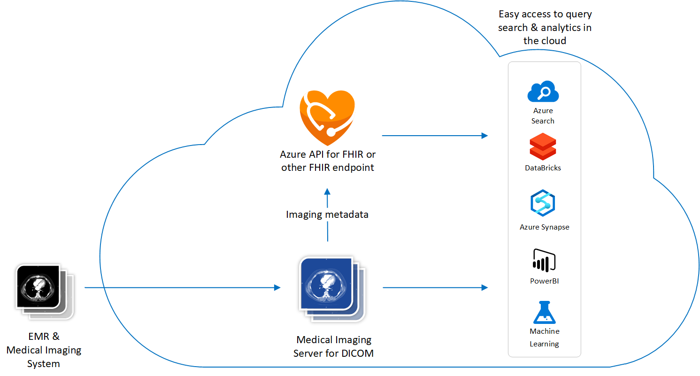

# Medical Imaging Server for DICOM

> [!IMPORTANT]
> 📢 **After more than 3 years, our team is planning to archive the DICOM server project to allow us to focus on delivering customer value to our [managed service offering on Azure](https://learn.microsoft.com/en-us/azure/healthcare-apis/dicom/overview). We plan to archive the DICOM server project on April 30, 2024**
> 
> Learn more in our recent [discussion post](https://github.com/microsoft/dicom-server/discussions/3401)

The Medical Imaging Server for DICOM is an open source DICOM server that is easily deployed on Azure. It allows standards-based communication with any DICOMweb&trade; enabled systems, and injects DICOM metadata into a FHIR server to create a holistic view of patient data. The Medical Imaging Server for DICOM integrates tightly with the [FHIR Server for Azure](https://github.com/microsoft/fhir-server) enabling healthcare professionals, ISVs, and medical device vendors to create new and innovative solutions. FHIR is becoming an important standard for clinical data and provides extensibility to support integration of other types of data directly, or through references. By using the Medical Imaging Server for DICOM, organizations can store references to imaging data in FHIR and enable queries across clinical and imaging datasets.

The Medical Imaging Server for DICOM is a .NET Core implementation of DICOMweb&trade;. [DICOMweb&trade;](https://www.dicomstandard.org/using/dicomweb) is the DICOM Standard for web-based medical imaging. Details of our conformance to the standard can be found in our [Conformance Statement](docs/resources/conformance-statement.md).

## Managed service

Azure Health Data Service [DICOM service](https://docs.microsoft.com/en-us/azure/healthcare-apis/dicom/deploy-dicom-services-in-azure) is a managed service and recommended for production deployment.

Only the Nuget libraries released from this repo are meant to be used in production.
Review [maintainance guide]( ./docs/resources/dicom-server-maintaince-guide.md) if you want to manage your own deployment from this repo.

## Deploy the Medical Imaging Server for DICOM

The Medical Imaging Server for DICOM is designed to run on Azure. However, for development and test environments it can be deployed locally as a set of Docker containers to speed up development.

### Deploy to Azure

If you already have an Azure subscription, deploy the Medical Imaging Server for DICOM directly to Azure:  
    

To sync your Medical Imaging Server for DICOM metadata directly into a FHIR server, deploy **DICOM Cast** (alongside a FHIR OSS Server and Medical Imaging Server for DICOM) via:  
    

For a complete set of instructions for how to deploy the Medical Imaging Server for DICOM to Azure, refer to the Quickstart [Deploy to Azure ](docs/quickstarts/deploy-via-azure.md).

### Deploy locally

Follow the [Development Setup Instructions](docs/development/setup.md) to deploy a local copy of the Medical Imaging Server for DICOM. Be aware that this deployment leverages the [Azurite container](https://github.com/Azure/Azurite) which emulates the Azure Storage API, and should not be used in production.

Note that the webapp library, ARM templates and Web.Zip package are for testing purposes only, they are not recommended for production scenarios. These will not be versioned. You can find the artifact feed generated by the Medical Imaging Server for DICOM at the [Azure Devops Public Feed](https://microsofthealthoss.visualstudio.com/FhirServer/_packaging?_a=feed&feed=Public), including the versioned packages.

## Quickstarts

- [Deploy Medical Imaging Server for DICOM via Azure](docs/quickstarts/deploy-via-azure.md)
- [Deploy Medical Imaging Server for DICOM via Docker](docs/quickstarts/deploy-via-docker.md)
- [Set up DICOM Cast](docs/quickstarts/deploy-dicom-cast.md)

## Tutorials

- [Use the Medical Imaging Server for DICOM APIs](docs/tutorials/use-the-medical-imaging-server-apis.md)
- [Use DICOMweb&trade; Standard APIs with C#](docs/tutorials/use-dicom-web-standard-apis-with-c%23.md)
- [Use DICOMweb&trade; Standard APIs with Python](docs/tutorials/use-dicom-web-standard-apis-with-python.md)
- [Use DICOMweb&trade; Standard APIs with cURL](docs/tutorials/use-dicom-web-standard-apis-with-curl.md)

## How-to guides

- [Configure Medical Imaging Server for DICOM server settings](docs/how-to-guides/configure-dicom-server-settings.md)
- [Enable Authentication and retrieve an OAuth token](docs/how-to-guides/enable-authentication-with-tokens.md)
- [Enable Authorization](docs/how-to-guides/enable-authorization.md)
- [Pull Changes from Medical Imaging Server for DICOM with Change Feed](docs/how-to-guides/pull-changes-from-change-feed.md)
- [Sync DICOM metadata to FHIR](docs/how-to-guides/sync-dicom-metadata-to-fhir.md)
- [Extended Query Tags](docs/how-to-guides/extended-query-tags.md)

## Concepts

- [DICOM](docs/concepts/dicom.md)
- [Change Feed](docs/concepts/change-feed.md)
- [DICOM Cast](docs/concepts/dicom-cast.md)

## Resources

- [FAQ](docs/resources/faq.md)
- [Conformance Statement](docs/resources/conformance-statement.md)
- [Health Check API](docs/resources/health-check-api.md)
- [Performance Guidance](docs/resources/performance-guidance.md)
- [Api Versions](docs/api-versioning.md)

## Development

- [Setup](docs/development/setup.md)
- [Code Organization](docs/development/code-organization.md)
- [Naming Guidelines](docs/development/naming-guidelines.md)
- [Exception handling](docs/development/exception-handling.md)
- [Tests](docs/development/tests.md)
- [Identity Server Authentication](docs/development/identity-server-authentication.md)
- [Roles](docs/development/roles.md)
- [API Versioning (developer)](docs/development/api-versioning-developers.md)

## Contributing

This project welcomes contributions and suggestions.  Most contributions require you to agree to a
Contributor License Agreement (CLA) declaring that you have the right to, and actually do, grant us
the rights to use your contribution. For details, visit https://cla.microsoft.com.

When you submit a pull request, a CLA-bot will automatically determine whether you need to provide
a CLA and decorate the PR appropriately (e.g., label, comment). Simply follow the instructions
provided by the bot. You will only need to do this once across all repositories using our CLA.

There are many other ways to contribute to Medical Imaging Server for DICOM.
* [Submit bugs](https://github.com/Microsoft/dicom-server/issues) and help us verify fixes as they are checked in.
* Review the [source code changes](https://github.com/Microsoft/dicom-server/pulls).
* Engage with Medical Imaging Server for DICOM users and developers on [StackOverflow](https://stackoverflow.com/questions/tagged/medical-imaging-server-for-dicom).
* Join the [#dicomonazure](https://twitter.com/hashtag/dicomonazure?f=tweets&vertical=default) discussion on Twitter.
* [Contribute bug fixes](CONTRIBUTING.md).

See [Contributing to Medical Imaging Server for DICOM](CONTRIBUTING.md) for more information.

This project has adopted the [Microsoft Open Source Code of Conduct](https://opensource.microsoft.com/codeofconduct/).
For more information see the [Code of Conduct FAQ](https://opensource.microsoft.com/codeofconduct/faq/) or
contact [opencode@microsoft.com](mailto:opencode@microsoft.com) with any additional questions or comments.
