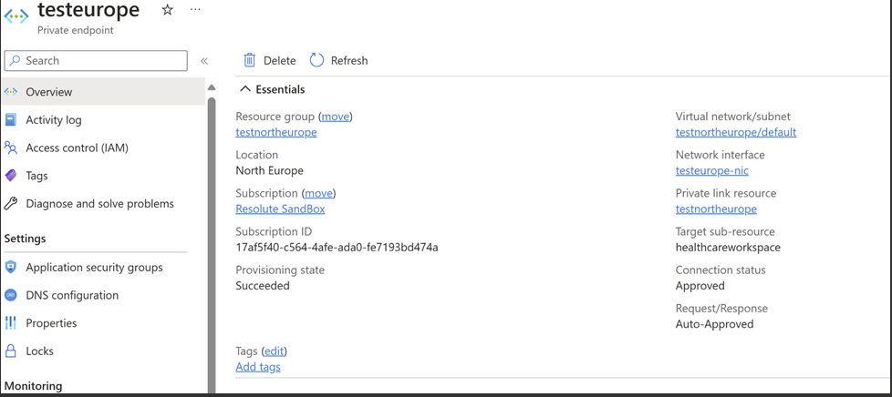

# Configuration steps for dicomast to work with privatelink enabled dicom service

1. Create a virtual network with two subnets within the same subscription and region as you would plan to create the health data services workspace 

2. Provision Healthdataservice workspace, dicomserver and fhir service in the same region.
3. Enable Privatelink to Healthdataservice workspace. This privatelink would use the Virtual network created in step 1 and default subnet

4. Use the template given [here](DicomcastDeploymentTemplate.md) to deploy dicomcast within a virtual network created in step 1. This will use the subnet that is delegated to Microsoft.containerinstance/containergroups as shown in picture in step 1. 
5. Add the following role assignments to the workspace  on the container instances SAMI. 
    1. DicomDataOwner 
    2. Fhir Data Contributor   

6. Dicomcast needs to talk to  the table storage within the storageaccount for processing the changefeed. therefore enable privatelink to the storage account created as a part of template deployment in step 5.  This privatelink should also be in same vnet  and default subnet that is created in step 1. 

7. Disable public network access for the storage account (`Security + Networking` > `Networking` > `Firewalls and virtual networks` > `Public Network Acccess` > `Disabled`)

8. Ensure all the fields mentioned here are populated in the keyvault provisioned in step 5. https://github.com/microsoft/dicom-server/blob/main/docs/how-to-guides/sync-dicom-metadata-to-fhir.md#update-key-vault-for-dicom-cast 

9. Restart dicomcast container. It should be running and talking to dicomcast successfully. 

