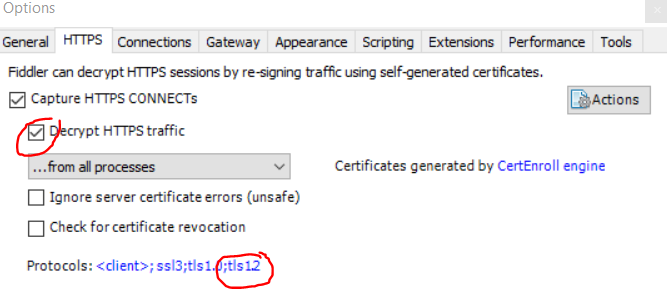
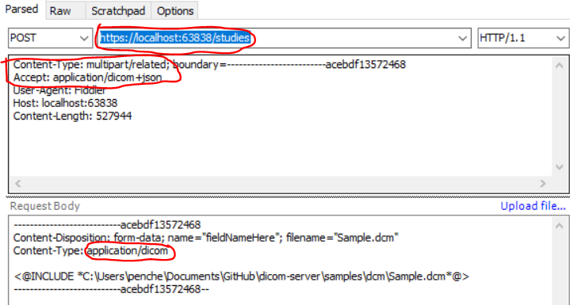

# Developing
## Requirements
- [Azure storage emulator](https://go.microsoft.com/fwlink/?linkid=717179)
- Sql Server 2019 with Full text index feature
- .Net core SDK version specified [here](../global.json)

## Getting Started in Visual Studio
### To Develop
- Install Visual Studio 2019
- [Clone the dicom-server repo](https://github.com/microsoft/dicom-server.git)
- Navigate to the cloned dicom-server directory
- Open Microsoft.Health.Dicom.sln in VS
- Build
- Make sure the storage emulator is running
- Run all tests from the Test explorer

# Testing
- Set Microsoft.Health.Dicom.Web as your startup project
- Run the project
- Web server is now running at https://localhost:63838/

## Fiddler to Post dcm files
- [Install fiddler](https://www.telerik.com/download/fiddler)
- Go to Tools->Options->HTTPS on fiddler. Click protocols and add "tls1.2" to the list of protocols.


- Download DCM example file from [here](https://microsofthealth.visualstudio.com/Health/_git/dicom-samples?path=%2Fvisus.com%2Fcase1%2Fcase1_008.dcm) 
- Upload DCM file (use upload file button at request body section as shown in picture below) 
- Update request header:
	- Accept: application/dicom+json
	- Content-Type: multipart/related
- Update request body:
   - Content-Type: application/dicom
   - Post the request to https://localhost:63838/studies


- Note: you cannot upload same DCM file again unless deleting it at first

## Postman for Get
- [Install Postman](https://www.postman.com/downloads/)
- Example QIDO to get all studies
```http
GET https://localhost:63838/studies
accept: application/dicom+json
```
