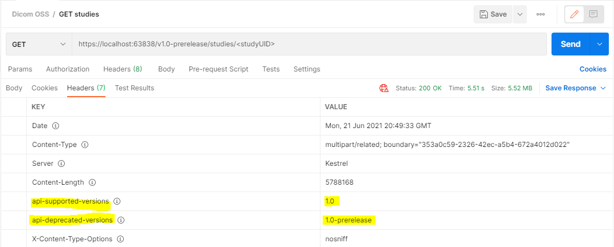

# API Versioning for DICOM Server

This guide gives an overview of the API version policies for DICOM Server. 

All versions of the DICOM APIs will always conform to the DICOMweb™ Standard specifications, but versions may expose different APIs based on our [conformance statement](https://github.com/microsoft/dicom-server/blob/main/docs/resources/conformance-statement.md).

## Specifying version of REST API in Requests

The version of the REST API should be explicitly specified in the request URL as in the following example: 

`https://<service_url>/v<version>/studies`

Currently routes without a version are still supported (ex. `https://<service_url>/studies`) and has the same behavior as specifying the version as v1.0-prerelease. However, we strongly recommended to specify the version in all requests via the URL.


### Supported Versions

Currently the supported versions are:
- v1.0-prerelease

The OpenApi Doc for the supported versions can be found at the following url: `https://<service_url>/{version}/api.yaml`


### Prerelease versions

An API version with the label "prerelease" indicates that the version is not ready for production, and should only be used in testing environments. These endpoints may experience breaking changes without notice.

### How Versions Are Incremented

We currently only increment the major version whenever there is a breaking change which is considered to be not backwards compatible. All minor versions are implied to be `0`. All versions are in the format `Major.0`

Some Examples of a breaking change (Major version is incremented):
1. Renaming or removing endpoints
2. Removing parameters or adding mandatory parameters
3. Changing status code
4. Deleting property in response or altering response type at all (but okay to add properties to the response)
5. Changing the type of a property
6. Behavior of an API changes (changes in business logic, used to do foo, now does bar)

Non-breaking changes (Version is not incremented):
1. Addition of properties that are nullable or have a default value
2. Addition of properties to a response model
3. Changing the order of properties

### Headers in responses

`ReportApiVersions` is turned on, which means we will return the headers `api-supported-versions` and `api-deprecated-versions` when appropriate.

- `api-supported-versions` will list which versions are supported for the requested API. It is only returned when calling an endpoint annotated with `[ApiVersion("<someVersion>")]`. 

- `api-deprecated-versions` will list which versions have been deprecated for the requested API. It is only returned when calling an endpoint annotated with `[ApiVersion("<someVersion>", Deprecated = true)]`.

Example:

```
[ApiVersion("1.0")]
[ApiVersion("1.0-prerelease", Deprecated = true)]
```

