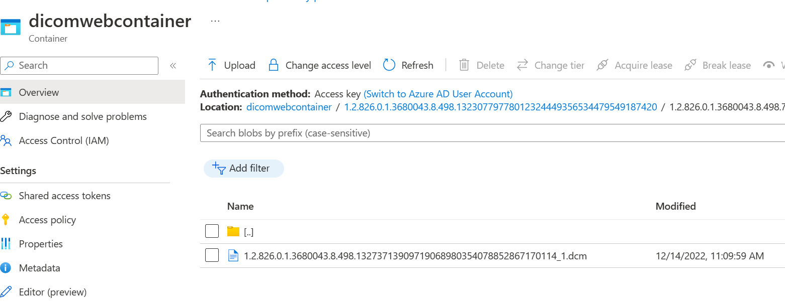

# Blob migration

*NOTE:* We have performed this migration already for our PAAS users and our PAAS users do not need to take any action.

If you're using Dicom OSS and hosting it yourself, read on.

Currently DICOM files are stored with DICOM UIDs as blob names in blob storage, using the template `{account}/{container}/{studyUid}/{seriesUid}/{sopInstanceUid}_{watermark}.dcm`.
You can see this naming scheme in your blob container if you've saved any files:


Since UIDs may include personal information about the context of their creation, such as patient information or identifiers, we made the decision to change the way that we store DICOM files. In the next sections we list the steps to migrate your existing blobs from the old format to the new format.

## Blob migration configuration
Below is the `appsettings.json` configuration related to blob migration. Several properties need to be updated to trigger migration.

```json
"DicomServer": {
    "Services": {
      "BlobMigration": {
        "FormatType": "Old",
        "StartCopy": false,
        "StartDelete": false,
        "CopyFileOperationId": "1d4689da-ca3b-4659-b0c7-7bf6c9ff25e1",
        "DeleteFileOperationId": "ce38a27e-b194-4645-b47a-fe91c38c330f",
        "CleanupDeletedFileOperationId": "d32a0469-9c27-4df3-a1e8-12f7f8fecbc8",
        "CleanupFilterTimeStamp": "2022-08-01"
      }
    }
}
```

The same settings can be adjusted as part of the `App Service` Azure Service's Configuration settings if you used the [Deploy to Azure option from our README.](https://github.com/microsoft/dicom-server#deploy-to-azure) :


## Migration steps

### If deployed new service and have not created any files yet
1. [You can upgrade to the latest version of the service](../resources/dicom-server-maintaince-guide.md) and skip the migration steps. The configuration section `Blob Migration` will not be present when service is on the latest version.

### If you have already uploaded DICOM files but do not care about migrating the data
1. If you have already uploaded DICOM files but do not care about migrating the data, you can use the [Delete API](../resources/conformance-statement.md#delete) to delete all existing studies.
2. [You can upgrade to the latest version of the service](../resources/dicom-server-maintaince-guide.md) and skip the migration steps. The configuration section `Blob Migration` will not be present when service is on the latest version.

### If you have already uploaded DICOM files and want to migrate the data
If you have already uploaded DICOM files and want to migrate the data, you will need to execute the following steps before upgrading. This scenario has two options depending on whether if you want interruption to the service or not. Make sure Azure Monitor is configured to monitor the service before starting the migration (for more info on how to configure Azure monitor, please refer to [the Azure Monitor guide](../how-to-guides/configure-dicom-server-settings.md#azure-monitor)).

#### With Service Interruption
If you are ok with interruption to the service, you can follow the steps below. The interruption here is a self-managed one and using the service while the copying is occuring and before switching to the new format can corrupt the data path or retrieve wrong data.

1. Set `BlobMigration.StartCopy` to `true` and restart the service.
   1. This will trigger the `CopyFiles` Durable Function which will copy the old format DICOM files to the new format.
   2. **Do not use the service at this time**. We want to make sure all files are copied over.
2. To ensure Copy has been completed, you can check Azure Monitor logs for `"Completed copying files."` message. This will indicate that the copy has been completed.
3. Once the copy is completed, you can change `BlobMigration.FormatType` to `"New"` and `BlobMigration.StartDelete` to `true` and restart the service. This will trigger a Durable Function which will delete all the old format blobs only if corresponding new format blobs exist. This is a safe operation and doesn't delete any blobs without checking for the existence of new format blobs.
   1. **Start using your service** to store and retrieve data, which will work with the `New` format.
4. To ensure Delete has been completed, you can check Azure Monitor logs for `"Completed deleting files."` message. This will indicate that the delete has been completed.

#### Without Service Interruption
If you are not ok with interruption to the service, you can follow the steps below.

1. Change `BlobMigration.FormatType` to `"Dual"`
   1. This will duplicate any new DICOM files uploaded to both old and new format as you continue to use your service during the copying operation.
2. Follow steps in [With Service Interruption](#with-service-interruption).

**Note: If in case there are any issues or questions during migration, you can post your questions or issues in the [DICOM Server GitHub Discussions](https://github.com/microsoft/dicom-server/discussions/1561) page.**`

