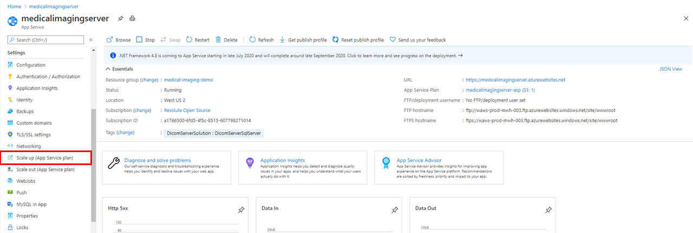
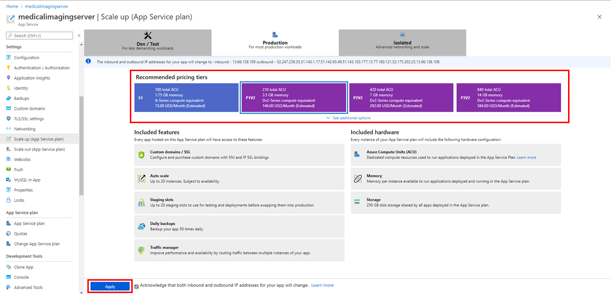
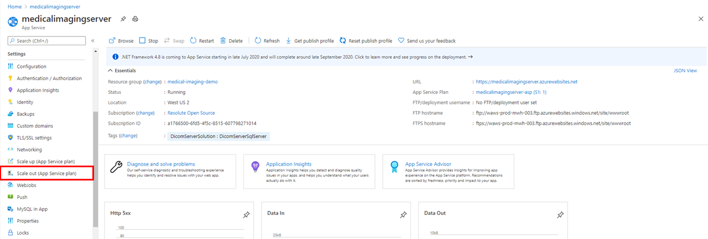
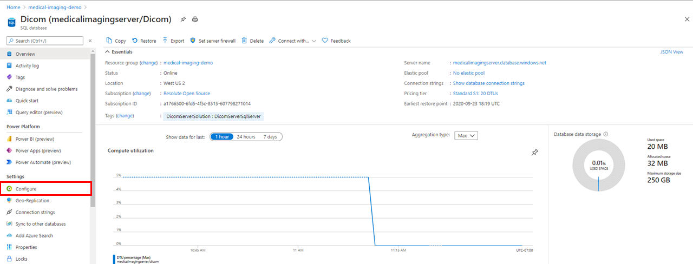
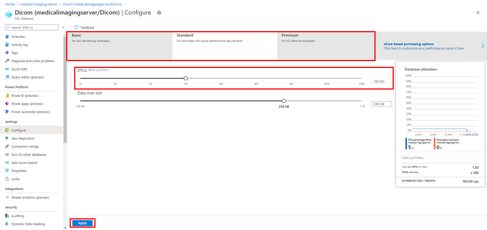
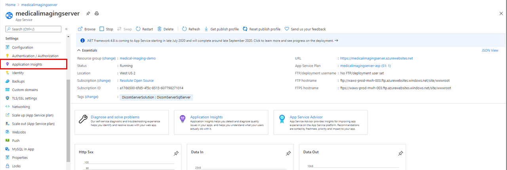
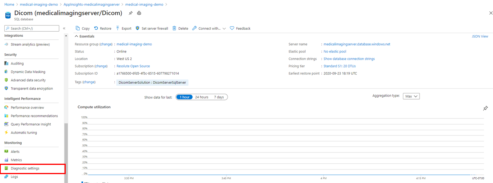
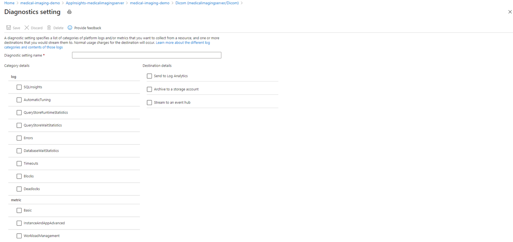
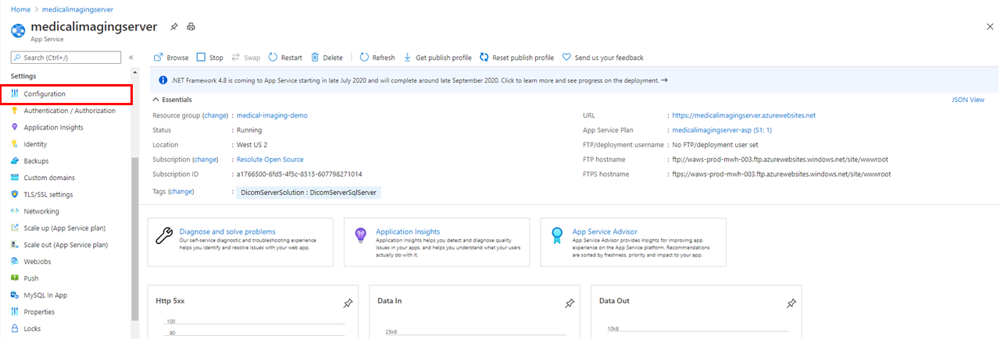
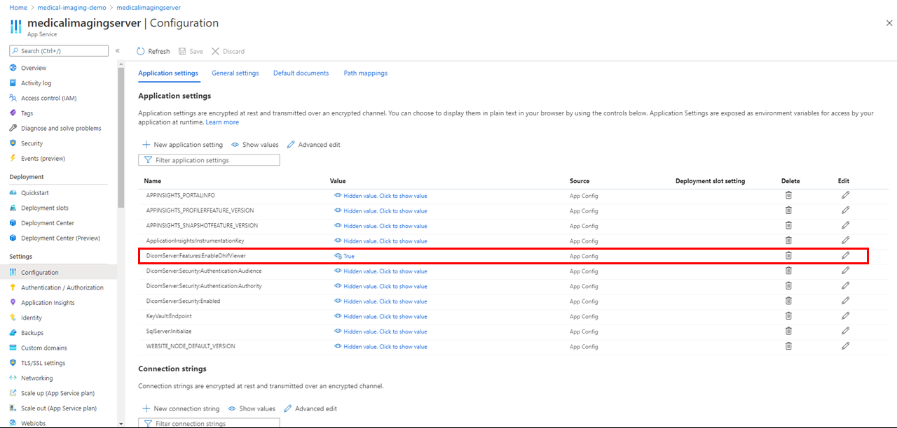

# Configure Medical Imaging Server for DICOM Settings

This How-to Guide explains how to configure settings for the Medical Imaging Server for DICOM after deployment.

## Prerequisites

To configure your Medical Imaging Server for DICOM, you need to have an instance deployed. If you have not already deployed the Medical Imaging Server, [deploy an instance to Azure](../quickstarts/deploy-via-azure.md).

## Manage Authentication

To configure authentication for the Medical Imaging Server for DICOM using Azure AD, see [Enable Authentication with Tokens](../how-to-guides/enable-authentication-with-tokens.md).

To manage authentication in development and test scenarios without AAD integration using an Identity Provider, see [Identity Server Authentication](../development/identity-server-authentication.md).

## Manage Azure App Service

The S1 tier is the default App Service Plan SKU enabled upon deployment. Azure offers a variety of plans to meet your workload requirements. To learn more about the various plans, view the [App Service pricing](https://azure.microsoft.com/pricing/details/app-service/windows/).

If you would like to Scale Up your App Service plan to a different tier:

1. Navigate to your Medical Imaging Server for DICOM **App Service** in the Azure Portal.
1. Select **Scale up (App Service plan)** from the menu:

1. Select the plan that fits your workload requirements:

1. Click **Apply**.

Autoscale is a built-in feature that helps applications perform their best when demand changes. You can choose to scale your resource manually to a specific instance count, or via a custom Autoscale policy that scales based on metric(s) thresholds, or scheduled instance count which scales during designated time windows. Autoscale enables your resource to be performant and cost effective by adding and removing instances based on demand

In addition to Scale Up, you can also Scale Out your App Service Plan to meet the requirements of your workload. You can select to manually scale your service to maintain a fixed instance count, or custom autoscale your service based on any metrics. If you would like to Scale Out your App Service Plan:

1. Navigate to your Medical Imaging Server for DICOM **App Service** in the Azure Portal.
1. Select **Scale out (App Service plan)** from the menu:

1. Choose the Scale Out option that best fits your requirements:

1. Select **Save**.

## Manage SQL Database

The Standard tier of the DTU-based SQL performance tiers is enabled by default upon deployment. In DTU-based SQL purchase models, a fixed set of resources is assigned to the database via performance tiers: Basic, Standard and Premium. To learn more about the various tiers, view the [Azure SQL Database Pricing](https://azure.microsoft.com/pricing/details/sql-database/single/).

If you would like to update your SQL Database tier:

1. Navigate to the **SQL Database** you created when you deployed the Medical Imaging Server for DICOM.
1. Select **Configure**:

1. Choose the performance tier and DTU level that meets your workload requirements:

1. Click **Apply**.

## Azure Monitor

[Azure Monitor](https://docs.microsoft.com/azure/azure-monitor/overview) offers a variety of solutions to collect, analyze and act on telemetry, including Application Insights Log Analytics.

### Application Insights

If you deploy the Medical Imaging Server for DICOM with our [Quickstart Deploy to Azure](../quickstarts/deploy-via-azure.md), Application Insights is deployed and enabled by default. To view and customize Application Insights:

1. Navigate to your Medical Imaging Server for DICOM **Application Insights** resource.
1. Select **Availability**, **Failures** or **Performance** for insight into the performance of your App Service.
1. To link your Application Insights resource to your Medical Imaging Server for DICOM Web App:
    1. Navigate to your Medical Imaging Server for DICOM **App Service**.
    1. Select **Application Insights** under **Settings**. Select *Enable* Application Insights. Select the existing Application Insights resource which was deployed.
    1. Optionally, you can enable Application Insights features like *Profiler*, *Snapshot Debugger* and *SQL Commands*. (Note, these can be turned on later).
    1. Click *Apply*. 
1. To learn how to customize Application Insights for your requirements, see [Application Insights Overview](https://docs.microsoft.com/azure/azure-monitor/app/app-insights-overview). 

If you did not enable Application Insights during deployment, you can via the Azure Portal:

1. Navigate to your Medical Imaging Server for DICOM **App Service**.
1. Select **Application Insights** from the menu:

1. Select **Turn on Application Insights**:

1. Link your App Service to an Application Insights Resource. You can create a new name for your **Application Insights** resource or use the default name. Select **Apply**.
1. View and customize **Application Insights** by navigating to the created **Application Insights** resource.

### Diagnostic Settings & Log Analytics

To monitor your SQL Database, create diagnostic settings which stream to Log Analytics:

1. Navigate to your **SQL Database**.
1. Select **Diagnostic Settings**:

1. Select **Add Diagnostic setting**:

1. Select the log and/or metric diagnostic settings you would like to monitor, along with the destination for those logs and/or metrics:

1. Select **Save**.

To learn how to customize your diagnostic settings further, see [Diagnostic Settings](https://docs.microsoft.com/azure/azure-monitor/platform/diagnostic-settings?WT.mc_id=Portal-Microsoft_Azure_Monitoring). To learn how to write queries with Log Analytics, see [Log Query Overview](https://docs.microsoft.com/azure/azure-monitor/log-query/log-query-overview).

## OHIF Viewer

By default, OHIF Viewer is enabled when you deploy the Medical Imaging Server for DICOM to Azure. To update this setting:

1. Navigate to your Medical Imaging Server for DICOM **App Service** in the Azure Portal.
1. Select **Configuration** from the menu:

1. Select the *Edit* button for **DicomServer:Features:EnableOhifViewer**:

1. Update the **Value** to *False* and select **Ok**.
1. Click **Save** to update the setting.

## Summary

This How-to Guide explained how to configure settings for the Medical Imaging Server for DICOM after deployment. Once your Medical Imaging Server for DICOM is deployed and configured, you can [Use Medical Imaging Server for DICOM APIs](../tutorials/use-the-medical-imaging-server-apis.md).
